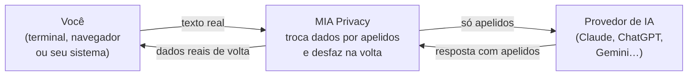

# MIA Privacy

> **A IA não precisa saber o nome do seu cliente para te ajudar.**
> A OpenAI, a Anthropic e o Google não precisam receber os dados dos seus clientes.

**MIA Privacy** fica no meio do caminho entre você e a inteligência artificial: troca
nome, CPF, endereço, telefone e outros dados sensíveis por *apelidos* **antes** de o
texto sair, e desfaz a troca quando a resposta volta. A IA responde normalmente — só que
nunca vê o dado real.

> 🗓️ **Domingo, 30 de agosto de 2026, liberamos aqui o link para você testar a ferramenta.**
> Deixe uma ⭐ no repositório para ser avisado.

<b>🇬🇧 English / 🇮🇹 Italiano</b> — short version for readers outside Brazil

**EN —** MIA Privacy sits between you and the AI: it replaces names, ID numbers, addresses,
phones, cards and API keys with *aliases* **before** the text leaves your machine, and puts the
real values back when the answer returns. The AI works normally — it just never sees the real
data. Deterministic check-digit rules + a fine-tuned recognition model (based on
[rizzo-pii](https://github.com/Rizzo-AI-Academy/rizzo-pii), MIT). Works with Claude Code and
Codex in the terminal, with Claude / ChatGPT / Gemini in the browser, and with documents
(PDF, DOCX, XLSX, CSV, images via OCR). **WikiSecret** is an encrypted "second brain" the AI
can consult without ever seeing the originals. Portuguese available now; **Spanish and
English** (national IDs of 39 countries + API keys/secrets) in training. Public test link:
**Sunday, 30 August 2026**, here.

**IT —** MIA Privacy sta nel mezzo tra te e l'IA: sostituisce nomi, documenti, indirizzi,
telefoni, carte e chiavi API con *pseudonimi* **prima** che il testo esca dalla tua macchina,
e rimette i valori reali quando la risposta torna. L'IA lavora normalmente — solo che non vede
mai il dato reale. Regole deterministiche con cifra di controllo + un modello di riconoscimento
fine-tuned (basato su [rizzo-pii](https://github.com/Rizzo-AI-Academy/rizzo-pii) di Simone
Rizzo, MIT). Funziona con Claude Code e Codex nel terminale, con Claude / ChatGPT / Gemini nel
browser e con i documenti (PDF, DOCX, XLSX, CSV, immagini via OCR). **WikiSecret** è un
"secondo cervello" cifrato che l'IA consulta senza mai vedere gli originali. Portoghese
disponibile; **spagnolo e inglese** (documenti di 39 paesi + chiavi API/segreti) in
addestramento. Link pubblico di prova: **domenica 30 agosto 2026**, qui.

## Veja funcionando (com prints reais)

▶️ **Vídeo completo (53s):** [`mia-privacy-demo.mp4`](mia-privacy-demo.mp4)

E no seu terminal, você prova a qualquer momento com `mia prova` — ele mostra exatamente o que o provedor recebeu:

### O fluxo, em 30 segundos

▶️ **Vídeo do fluxo (32s):** [`mia-privacy-flow.mp4`](mia-privacy-flow.mp4) — você digita um prompt com o nome e o documento do cliente; dentro do MIA, na sua rede, eles viram `[NAME_1]` e `ID_1`; só os apelidos chegam à IA; a resposta volta e o nome real é restaurado na sua tela. **A IA ajuda muito — só não precisa saber quem é o seu cliente.**

### Versões verticais (reels 9:16)

Para Instagram / TikTok / Shorts, com narração em inglês:
- ▶️ [`reels/mia-privacy-flow-reel.mp4`](reels/mia-privacy-flow-reel.mp4) — o fluxo (52s)
- ▶️ [`reels/mia-privacy-demo-reel.mp4`](reels/mia-privacy-demo-reel.mp4) — prints reais (63s)
- ▶️ [`reels/mia-privacy-datos-reel.mp4`](reels/mia-privacy-datos-reel.mp4) — o que acontece com os seus dados (46s)

---

## O problema

Toda vez que alguém cola uma petição, um prontuário ou uma planilha numa IA, o dado sai
da sua sala e entra num servidor que não é seu, num país que não é o seu. Depois de sair,
você não controla mais onde ele fica, quem lê, nem por quanto tempo.

## O que o MIA Privacy faz

Três coisas, ao mesmo tempo:

| | |
|---|---|
| 🛡️ **Protege os dados sensíveis** | Os dados viram apelidos antes de chegar na IA; voltam ao normal só na sua tela. |
| 🪙 **Economiza tokens** | A IA trabalha sobre um texto mais limpo e direto — menos ruído, menos custo. |
| 🎯 **Faz a IA responder melhor** | Com o **WikiSecret** (seu segundo cérebro), a IA responde com o seu contexto, sem ver os originais. |

## Como funciona

- **Determinístico + inteligente.** Documentos com dígito verificador (CPF, CNPJ, cartão…)
  são conferidos por regra; nomes, endereços e organizações, por um modelo de reconhecimento
  próprio — fine-tuning do [rizzo-pii](https://github.com/Rizzo-AI-Academy/rizzo-pii) (MIT). Se um dado com formato conferível escapar, o envio é **bloqueado** em vez de sair.
- **Reversível só na sua máquina.** A tabela que desfaz a troca nasce e morre com você — não
  sobe para servidor nenhum. Perdeu, ninguém desfaz. Nem você, nem a MIA.
- **O texto cru não é gravado.** Passa em memória, faz a troca e some.

## Onde funciona

- **Texto e documentos:** PDF, DOCX, XLSX, CSV, TXT — e **imagens / PDFs escaneados** por OCR.
- **Suas ferramentas de IA:** Claude Code e Codex no terminal (a IA continua a sua, só muda
  para onde ela fala), e Claude / ChatGPT / Gemini no navegador (copiar e colar).
- **Seu segundo cérebro (WikiSecret):** documentos e notas guardados já anonimizados, que a
  sua IA consulta sem nunca ver os dados reais.

## Privacidade por desenho

- O dado bruto **nunca descansa em disco** no servidor.
- A tabela de reversão (apelido → valor real) fica **cifrada e só com você**.
- Nada de treinar modelos com os seus dados. Sua assinatura de IA continua sua.

## Idiomas

- **Português do Brasil:** disponível.
- **Espanhol e inglês** (documentos de 39 países + chaves de API/segredos): **modelo em
  treinamento** — dataset de 400 mil exemplos pronto (27/08).

## Roteiro

- [x] Anonimizador de texto e documentos (pt-BR)
- [x] Ponte para Claude Code / Codex + WikiSecret (segundo cérebro cifrado)
- [x] OCR: imagens e PDFs escaneados viram texto leve
- [ ] **Domingo, 30/08:** link público para testar 🎉
- [ ] Versão multilíngue (espanhol + inglês)
- [ ] Detecção de chaves de API e segredos

---

### Quer testar?
Deixe uma ⭐ aqui — no **domingo 30/08/2026** publicamos o link neste README.

## Créditos

O modelo de reconhecimento do MIA Privacy é um **fine-tuning do
[rizzo-pii](https://github.com/Rizzo-AI-Academy/rizzo-pii)**, de **Simone Rizzo**
(licença MIT) — copyright e texto da licença mantidos nas distribuições. Obrigado, Simone:
o modelo e, principalmente, o seu conteúdo foram a base de tudo isto.

*MIA Privacy é um produto. Este repositório é a página de apresentação: explica o que a
ferramenta faz e como funciona, sem expor detalhes internos.*
