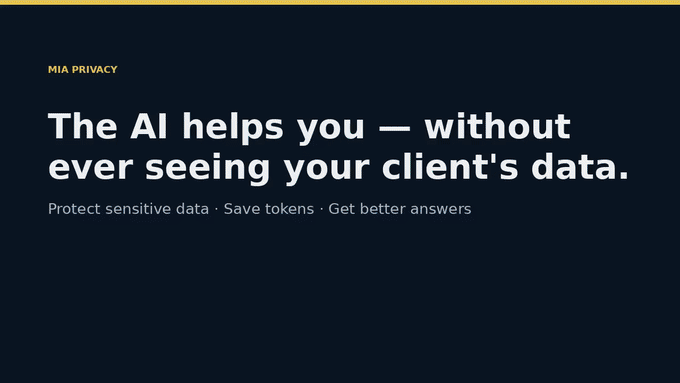
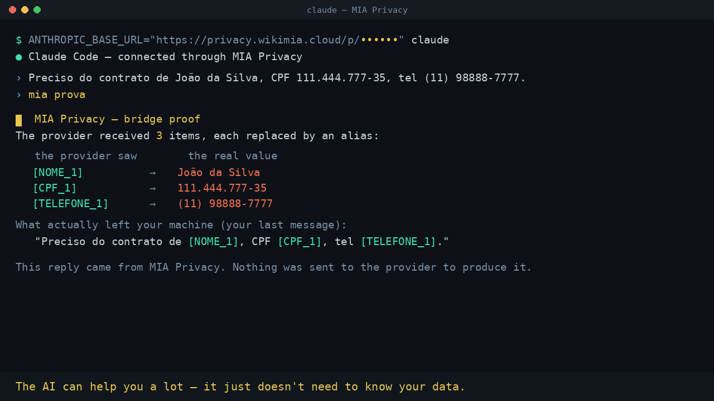
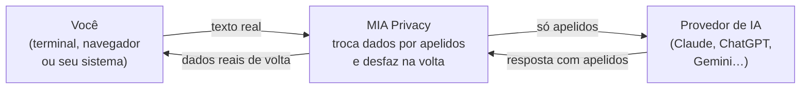

# MIA Privacy

> **A IA não precisa saber o nome do seu cliente para te ajudar.**
> A OpenAI, a Anthropic e o Google não precisam receber os dados dos seus clientes.

**MIA Privacy** fica no meio do caminho entre você e a inteligência artificial: troca
nome, CPF, endereço, telefone e outros dados sensíveis por *apelidos* **antes** de o
texto sair, e desfaz a troca quando a resposta volta. A IA responde normalmente — só que
nunca vê o dado real.

> 🗓️ **Domingo, 30 de agosto de 2026, liberamos aqui o link para você testar a ferramenta.**
> Deixe uma ⭐ no repositório para ser avisado.

## Veja funcionando (com prints reais)

▶️ **Vídeo completo (53s):** [`mia-privacy-demo.mp4`](mia-privacy-demo.mp4)

E no seu terminal, você prova a qualquer momento com `mia prova` — ele mostra exatamente o que o provedor recebeu:

### O fluxo, em 30 segundos

▶️ **Vídeo do fluxo (32s):** [`mia-privacy-flow.mp4`](mia-privacy-flow.mp4) — você digita um prompt com o nome e o documento do cliente; dentro do MIA, na sua rede, eles viram `[NAME_1]` e `ID_1`; só os apelidos chegam à IA; a resposta volta e o nome real é restaurado na sua tela. **A IA ajuda muito — só não precisa saber quem é o seu cliente.**

---

## O problema

Toda vez que alguém cola uma petição, um prontuário ou uma planilha numa IA, o dado sai
da sua sala e entra num servidor que não é seu, num país que não é o seu. Depois de sair,
você não controla mais onde ele fica, quem lê, nem por quanto tempo.

## O que o MIA Privacy faz

Três coisas, ao mesmo tempo:

| | |
|---|---|
| 🛡️ **Protege os dados sensíveis** | Os dados viram apelidos antes de chegar na IA; voltam ao normal só na sua tela. |
| 🪙 **Economiza tokens** | A IA trabalha sobre um texto mais limpo e direto — menos ruído, menos custo. |
| 🎯 **Faz a IA responder melhor** | Com o **WikiSecret** (seu segundo cérebro), a IA responde com o seu contexto, sem ver os originais. |

## Como funciona

- **Determinístico + inteligente.** Documentos com dígito verificador (CPF, CNPJ, cartão…)
  são conferidos por regra; nomes, endereços e organizações, por um modelo de reconhecimento
  próprio. Se um dado com formato conferível escapar, o envio é **bloqueado** em vez de sair.
- **Reversível só na sua máquina.** A tabela que desfaz a troca nasce e morre com você — não
  sobe para servidor nenhum. Perdeu, ninguém desfaz. Nem você, nem a MIA.
- **O texto cru não é gravado.** Passa em memória, faz a troca e some.

## Onde funciona

- **Texto e documentos:** PDF, DOCX, XLSX, CSV, TXT — e **imagens / PDFs escaneados** por OCR.
- **Suas ferramentas de IA:** Claude Code e Codex no terminal (a IA continua a sua, só muda
  para onde ela fala), e Claude / ChatGPT / Gemini no navegador (copiar e colar).
- **Seu segundo cérebro (WikiSecret):** documentos e notas guardados já anonimizados, que a
  sua IA consulta sem nunca ver os dados reais.

## Privacidade por desenho

- O dado bruto **nunca descansa em disco** no servidor.
- A tabela de reversão (apelido → valor real) fica **cifrada e só com você**.
- Nada de treinar modelos com os seus dados. Sua assinatura de IA continua sua.

## Idiomas

- **Português do Brasil:** disponível.
- **Espanhol e inglês** (documentos de dezenas de países + chaves de API/segredos): **em
  construção** — cobertura sendo ampliada agora.

## Roteiro

- [x] Anonimizador de texto e documentos (pt-BR)
- [x] Ponte para Claude Code / Codex + WikiSecret (segundo cérebro cifrado)
- [x] OCR: imagens e PDFs escaneados viram texto leve
- [ ] **Domingo, 30/08:** link público para testar 🎉
- [ ] Versão multilíngue (espanhol + inglês)
- [ ] Detecção de chaves de API e segredos

---

### Quer testar?
Deixe uma ⭐ aqui — no **domingo 30/08/2026** publicamos o link neste README.

*MIA Privacy é um produto. Este repositório é a página de apresentação: explica o que a
ferramenta faz e como funciona, sem expor detalhes internos.*
